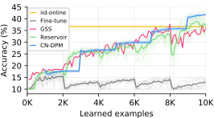
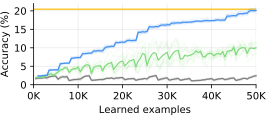

# Continual Neural Dirichlet Process Mixture
Official PyTorch implementation of ICLR 2020 paper: *A Neural Dirichlet Process Mixture Model for Task-Free Continual Learning*.

[**Paper**](https://openreview.net/forum?id=SJxSOJStPr)


## Experimental Results

### Summarization of the main experiments 
<table style="text-align: right">
    <thead>
        <tr>
            <td>Method</td>
            <td>Split-MNIST<br>Acc. (%)</td>
            <td>Split-MNIST (Gen.)<br>bits/dim</td>
            <td>MNIST-SVHN<br>Acc.(%)</td>
            <td>Split-CIFAR10<br>Acc.(%)</td>
            <td>Split-CIFAR100<br>Acc.(%)</td>
        <tr>
    </thead>
    <tbody>
        <tr>
            <td>iid-offline</td>
            <td>98.63</td>
            <td>0.1806</td>
            <td>96.69</td>
            <td>93.17</td>
            <td>73.80</td>
        </tr>
        <tr>
            <td>iid-online</td>
            <td>96.18</td>
            <td>0.2156</td>
            <td>95.24</td>
            <td>62.79</td>
            <td>20.46</td>
        </tr>
        <tr>
            <td>Fine-tune</td>
            <td>19.43</td>
            <td>0.2817</td>
            <td>83.35</td>
            <td>18.08</td>
            <td>2.43</td>
        </tr>
        <tr>
            <td>Reservoir</td>
            <td>85.69</td>
            <td>0.2234</td>
            <td>94.12</td>
            <td>44.00</td>
            <td>10.01</td>
        </tr>
        <tr>
            <td><b>CN-DPM</b></td>
            <td><b>93.23</b></td>
            <td><b>0.2110</b></td>
            <td><b>94.46</b></td>
            <td><b>45.21</b></td>
            <td><b>20.10</b></td>
        </tr>
    </tbody>
</table>

### Training Graphs
#### Split-CIFAR10 (0.2 Epoch) 


#### Split-CIFAR100


## System Requirements
- Python >= 3.6.1
- CUDA >= 9.0 supported GPU with at least 10GB memory


## Installation
1. Install PyTorch 1.0.1 and TorchVision 0.2.2 for your environment.
Follow the instructions in 
[HERE](https://pytorch.org/get-started/previous-versions/#v101).

2. Install other required packages.
```bash
$ pip install -r requirements.txt
```

## Usage
```bash
$ python main.py --help
usage: main.py [-h] [--config CONFIG] [--episode EPISODE] [--log-dir LOG_DIR]
            [--resume-ckpt RESUME_CKPT] [--override OVERRIDE]

optional arguments:
  -h, --help            show this help message and exit
  --config CONFIG, -c CONFIG
  --episode EPISODE, -e EPISODE
  --log-dir LOG_DIR, -l LOG_DIR
  --override OVERRIDE
```


## Composing Continual Learning Episodes
We provide a quick and easy solution to compose continual learning scenarios.
You can configure a scenario by writing a YAML file.
Here is an example of Split-CIFAR10 where each stage is repeated for 10 epochs: 
```yaml
- subsets: [['cifar10', 0], ['cifar10', 1]]
  epochs: 10
- subsets: [['cifar10', 2], ['cifar10', 3]]
  epochs: 10
- subsets: [['cifar10', 4], ['cifar10', 5]]
  epochs: 10
- subsets: [['cifar10', 6], ['cifar10', 7]]
  epochs: 10
- subsets: [['cifar10', 8], ['cifar10', 9]]
  epochs: 10
```
Basic rules:
- Each scenario consists of a list of stages.
- Each stage defines a list of subsets.
- A subset is a two-element list `[dataset_name, subset_name]`. By default, each class is defined as a subset with the class number as its name.
- Each stage may optionally define one of `epochs`, `steps`, and `samples` to set the length of the stage. Otherwise, the default length is set to 1 epoch.

The main logic is implemented in the `DataScheduler` in `data.py`.


## Reproducing Experiments
Run below commands to reproduce our experimental results. You can check summaries from Tensorboard.

### 1. MNIST Generation
#### iid Offline
```bash
$ python main.py \
    --config configs/mnist_gen-iid_offline.yaml \
    --episode episodes/mnist-iid-100epochs.yaml \
    --log-dir log/mnist_gen-iid_offline
```
#### iid Online
```bash
$ python main.py \
    --config configs/mnist_gen-iid_online.yaml \
    --episode episodes/mnist-iid-online.yaml \
    --log-dir log/mnist_gen-iid_online
```
#### Finetune
```bash
$ python main.py \
    --config configs/mnist_gen-iid_online.yaml \
    --episode episodes/mnist-split-online.yaml \
    --log-dir log/mnist_gen-finetune
```
#### Reservoir
```bash
$ python main.py \
    --config configs/mnist_gen-reservoir.yaml \
    --episode episodes/mnist-split-online.yaml \
    --log-dir log/mnist_gen-reservoir
```
#### CN-DPM
```bash
$ python main.py \
    --config configs/mnist_gen-cndpm.yaml \
    --episode episodes/mnist-split-online.yaml \
    --log-dir log/mnist_gen-cndpm
```

### 2. MNIST Classification
#### iid Offline
```bash
$ python main.py \
    --config configs/mnist-iid_offline.yaml \
    --episode episodes/mnist-iid-100epochs.yaml \
    --log-dir log/mnist-iid_offline
```
#### iid Online
```bash
$ python main.py \
    --config configs/mnist-iid_online.yaml \
    --episode episodes/mnist-iid-online.yaml \
    --log-dir log/mnist-iid_online
```
#### Finetune
```bash
$ python main.py \
    --config configs/mnist-iid_online.yaml \
    --episode episodes/mnist-split-online.yaml \
    --log-dir log/mnist-finetune
```
#### Reservoir
```bash
$ python main.py \
    --config configs/mnist-reservoir.yaml \
    --episode episodes/mnist-split-online.yaml \
    --log-dir log/mnist-reservoir
```
#### CN-DPM
```bash
$ python main.py \
    --config configs/mnist-cndpm.yaml \
    --episode episodes/mnist-split-online.yaml \
    --log-dir log/mnist-cndpm
```

### 3. MNIST-SVHN Classification
#### iid Offline
```bash
$ python main.py \
    --config configs/mnist_svhn-iid_offline.yaml \
    --episode episodes/mnist_svhn-iid-10epochs.yaml \
    --log-dir log/mnist_svhn-iid_offline
```
#### iid Online
```bash
$ python main.py \
    --config configs/mnist_svhn-iid_online.yaml \
    --episode episodes/mnist_svhn-iid-online.yaml \
    --log-dir log/mnist_svhn-iid_online
```
#### Finetune
```bash
$ python main.py \
    --config configs/mnist_svhn-iid_online.yaml \
    --episode episodes/mnist_svhn-online.yaml \
    --log-dir log/mnist_svhn-finetune
```
#### Reservoir
```bash
$ python main.py \
    --config configs/mnist_svhn-reservoir.yaml \
    --episode episodes/mnist_svhn-online.yaml \
    --log-dir log/mnist_svhn-reservoir
```
#### CN-DPM
```bash
$ python main.py \
    --config configs/mnist_svhn-cndpm.yaml \
    --episode episodes/mnist_svhn-online.yaml \
    --log-dir log/mnist_svhn-cndpm
```

### 4. CIFAR10 Classification
#### iid Offline
```bash
$ python main.py \
    --config configs/cifar10-iid_offline.yaml \
    --episode episodes/cifar10-iid-100epochs.yaml \
    --log-dir log/cifar10-iid_offline
```
#### iid Online
```bash
$ python main.py \
    --config configs/cifar10-iid_online.yaml \
    --episode episodes/cifar10-iid-online.yaml \
    --log-dir log/cifar10-iid_online
```
#### Finetune
```bash
$ python main.py \
    --config configs/cifar10-iid_online.yaml \
    --episode episodes/cifar10-split-online.yaml \
    --log-dir log/cifar10-finetune
```
#### Reservoir
```bash
$ python main.py \
    --config configs/cifar10-reservoir.yaml \
    --episode episodes/cifar10-split-online.yaml \
    --log-dir log/cifar10-reservoir
```
#### CN-DPM
```bash
$ python main.py \
    --config configs/cifar10-cndpm.yaml \
    --episode episodes/cifar10-split-online.yaml \
    --log-dir log/cifar10-cndpm
```
#### CN-DPM (0.2 Epoch)
```bash
$ python main.py \
    --config configs/cifar10-cndpm.yaml \
    --episode episodes/cifar10-split-0.2epoch.yaml \
    --log-dir log/cifar10-cndpm-0.2epoch
```
#### CN-DPM (10 Epochs)
```bash
$ python main.py \
    --config configs/cifar10-cndpm.yaml \
    --episode episodes/cifar10-split-10epochs.yaml \
    --log-dir log/cifar10-cndpm-10epoch
```

### 5. CIFAR100 Classification
#### iid Offline
```bash
$ python main.py \
    --config configs/cifar100-iid_offline.yaml \
    --episode episodes/cifar100-iid-100epochs.yaml \
    --log-dir log/cifar100-iid_offline
```
#### iid Online
```bash
$ python main.py \
    --config configs/cifar100-iid_online.yaml \
    --episode episodes/cifar100-iid-online.yaml \
    --log-dir log/cifar100-iid_online
```
#### Finetune
```bash
$ python main.py \
    --config configs/cifar100-iid_online.yaml \
    --episode episodes/cifar100-split-online.yaml \
    --log-dir log/cifar100-finetune
```
#### Reservoir
```bash
$ python main.py \
    --config configs/reservoir-resnet_classifier-cifar100.yaml \
    --episode episodes/cifar100-split-online.yaml \
    --log-dir log/cifar100-reservoir
```
#### CN-DPM
```bash
$ python main.py \
    --config configs/cifar100-cndpm.yaml \
    --episode episodes/cifar100-split-online.yaml \
    --log-dir log/cifar100-cndpm
```
